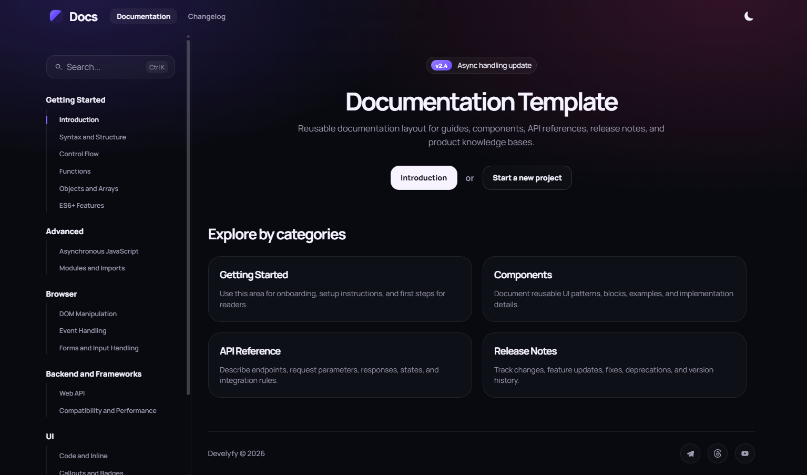

# Docs Template

Reusable static documentation template with a clean landing page, article navigation, changelog layout, and a set of UI blocks for product docs.

## Preview

## Features

- Documentation home page with hero, categories, and footer
- Fixed header and sidebar navigation
- Article pages with `On this page` navigation
- Previous / next page navigation
- Changelog page with timeline layout and version details
- Light and dark theme switcher
- Search inside sidebar sections
- UI documentation blocks:
  - code blocks with copy button
  - inline code
  - callouts
  - badges
  - tabs
  - steps
  - API table
  - response example
  - do / don't blocks
  - preview cards
  - screenshots with zoom
  - FAQ accordion
  - checklist
  - search result examples
  - empty states

## Structure

- `index.html` - main template markup
- `assets/scss/` - source styles
- `assets/js/app.js` - navigation, rendering, theme toggle, interactions
- `assets/css/main.min.css` - compiled stylesheet

## Usage

1. Edit content in `index.html` and `assets/js/app.js`
2. Update styles in `assets/scss/`
3. Compile `assets/scss/main.scss` into `assets/css/main.min.css`

## Notes

- The project is static and does not require a framework
- The template is suitable for product docs, UI kits, API docs, and release notes
